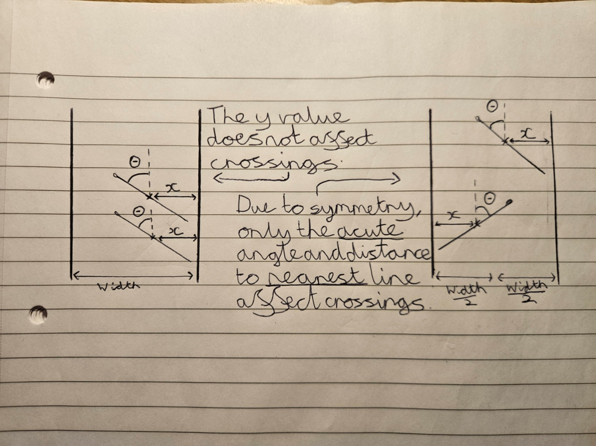
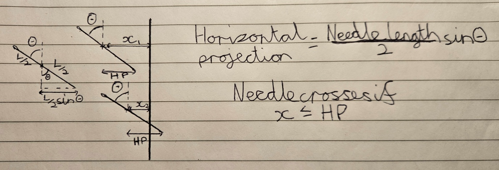
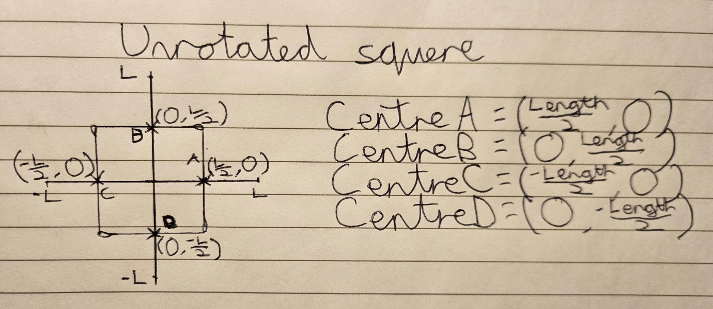
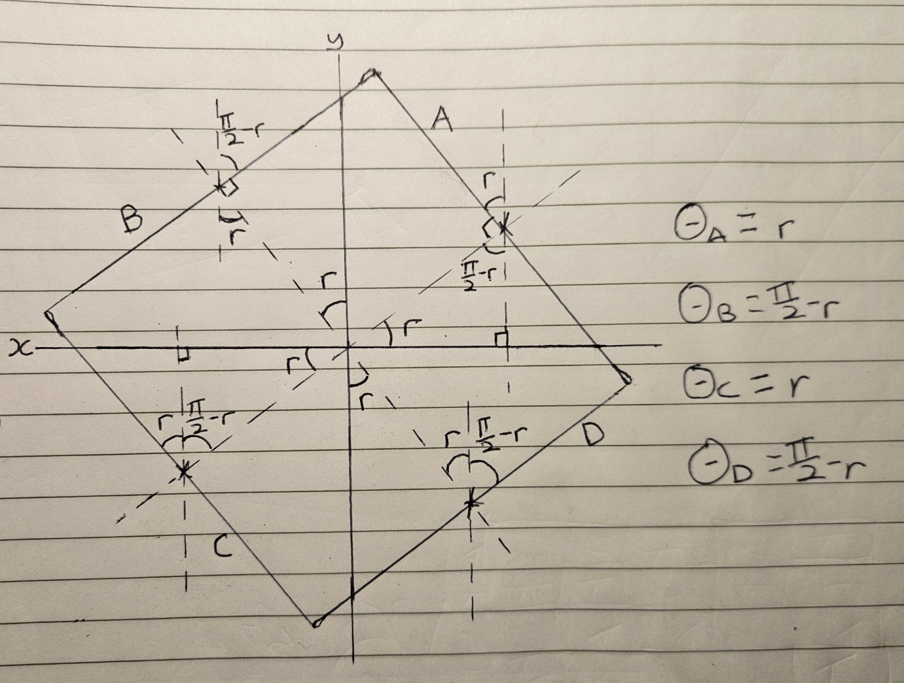
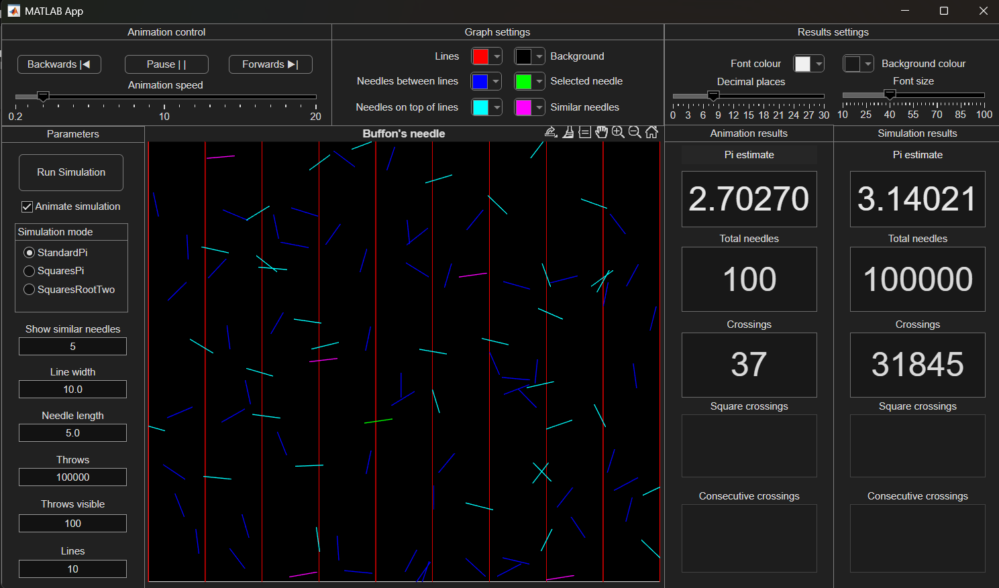
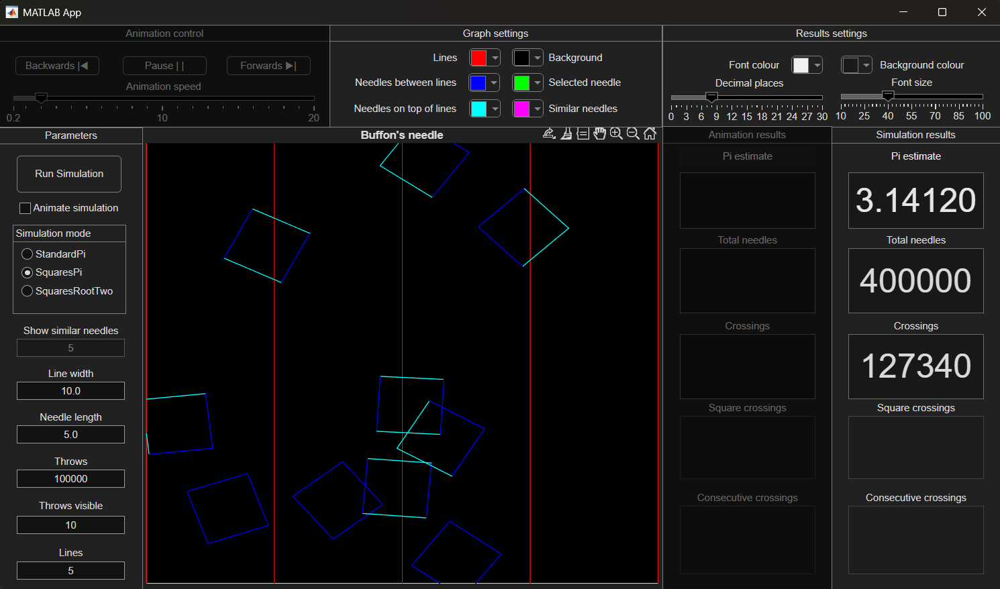
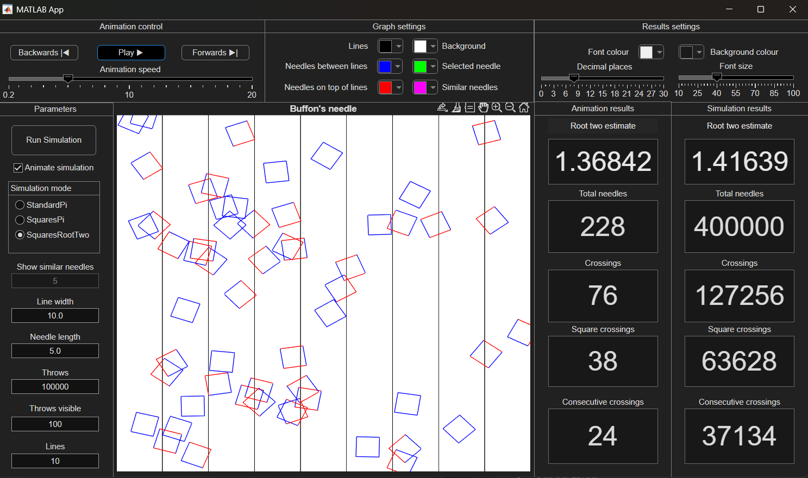

# Buffon-s-needle-simulation
This project simulates three variations of the Buffon's needle experiment using Matlab.
The functions BuffonStandardPi, BuffonSquaresPi and BuffonSquaresRootTwo simulate the experiment and 
return an estimate for pi / root two.
estimatePi, estimateRootTwo and throwSquares are helper functions used by the simulations.
buffonsNeedle.mlapp provides a GUI for running and visualising the experiment as an animation.

###BuffonStandardPi.m
The aim of this function is to simulate the standard Buffon’s needle experiment to estimate pi.
Default values are set first using nargin, ensuring the function returns a reasonable
estimate even with no input. All inputs are then validated.
To simulate random needles, I have represented them using two values; the scalar distance
between the needle’s centre and the nearest line, and the acute angle between the needle and the
lines. The crossing condition only depends on these values, as shown in Fig1.

Fig1

Therefore, needles can be generated using random angles between 0 and pi/2 and random distances
between 0 and width/2. As shown in Fig2, the needle will only cross if its distance to the nearest line
is less than or equal to its horizontal projection.

Fig2

These horizontal projections are computed and compared with the distances, resulting in a boolean
vector of needle crossings.
To estimate pi, I have defined a helper function estimatePi to separate the calculation from the
simulation. It takes the simulation parameters and results as inputs, and returns an estimate for pi
and a count of crossings.
NeedleCrosses is an array of 1 and 0s, so the crossing count can be found using sum(), avoiding the
need for a loop. If no needle crosses the line, division by 0 is avoided simply by returning 0 for the pi
estimate.
In the case that needle length L < line width W, the probability that a needle crosses a (2 * L) / (W *
pi), which can be rearranged into pi = (2 * L) / (W * P(needle crosses)). Therefore, to find an estimate
for pi, I use crossings/needles as an experimental probability of P(needle crosses), giving pi = (2 * L *
needles) / (W * crossings).
In the case where needle length L >= line width the probability gets more complicated, as it is now
possible that a needle can cross two lines at once. Like before, P(needle crosses) can be rearranged
to give an estimate for pi.
The main function then returns the estimate for pi, the number of crossings, and for the GUI it
returns the needles’ centre positions and angles. To avoid returning unneeded data, a nargout check
is used to return empty values, as returning large matrices when uncalled for is a waste of
processing speed.

###BuffonSquaresPi
This function simulates dropping squares as opposed to needles and uses the probability of an edge
crossing a line to estimate pi. As with the standard version, a nargin check is used to provide
flexibility and default values are set.
To generate squares, I have passed the logic on to a helper function throwSquares(), as the same
process will be used to generate squares in BuffonSquaresRootTwo. To represent a square, a 4x2
matrix is created with the centre points of each edge of the square as shown in Fig3. This matrix is
then repeated for the number of throws using the repmat() function.

Fig3

Random rotation angles are then generated for each square between 0 and pi/2, and the repelem()
function is used to repeat each angle 4 times for each side of the square. The individual needle’s
angle with the vertical lines will be the rotation angle for top edges, or (pi/2 – rotation angle) for side
edges, as shown below.

Fig4

A blank 2x2x(number of needles) matrix is then created using the zeros() function and filled with a
2d rotation matrix for each needle. The matrix of needle centre positions is then reshaped into a 3d
matrix to match the rotations using permute(). The rotations are then applied to the needles using
pagemtimes(), and the needle centres are reshaped back again.
Once the squares are rotated, they are translated a random amount between 0 and width/2 in the x
direction. The new x position is taken and folded over the interval 0:width/2 so that it represents the
distance to the nearest line. Now I have matrices of needle centre positions and angles just like in
buffonStandardPi, so I calculate whether each needle crosses a line using the horizontal projection
as before.
The main function inputs the returned values from the simulation straight into the estimatePi()
helper function, giving an estimate for pi and a count of needle crossings. A nargout check is made at
the end to prevent returning unnecessary values.

###BuffonSquaresRootTwo
This function simulates dropping squares to find an estimate for root two. Like before it provides
default values for parameters and validates inputs. For root two, the estimation is only valid if
squares can fit between the lines, so the needle length entered is checked to ensure the diagonals of
squares generated cannot exceed line width.

ThrowSquares() is called to generate needle centre positions, angles and crossings just like before.
To estimate root two, I have defined a helper function estimateRootTwo, which needs only the
matrix of crossings as its input. It uses the reshape() function to turn the needles x 1 crossings matrix
into throws x 4, where each column is a side A B C or D of a square. To compute square crossings,
the logical or operator is applied between each column. Consecutive crossings are calculated with
the Boolean expression A*B + B*C + C*D + D*A. Division by 0 is prevented, then an estimate for root
two is found using 2 – (consecutiveCrossings / squareCrossings).
Finally, unneeded return values are erased using a nargout check.

###Buffon’s needle GUI
This GUI provides a visual representation of the simulations. Users can select the variation
and input a wide range of parameters using the panel on the left, all inputs are validated. Pressing
‘Run Simulation’ will plot a graph showing planks of wood and the simulated dropped needles.

If the ‘Animate simulation’ parameter is checked, the needles will be dropped one by one, and the
panel in the top left corner can be used to control the animation’s speed, pause it, go back a frame
or go forward a frame. 

On completion of the animation, the user can click anywhere on the screen
and the nearest needle along with needles with similar orientations will be highlighted. At any time,
the colours of displayed elements can be changed using the centre panel at the top.

The returned values from the simulation and animation are displayed in the panels on the right, and
elements of the displayed values can be altered in the panel above.

The screenshots below demonstrate the app’s operation.

StandardPi after selecting a needle

SquaresPi without animation and fewer lines and needles

SquaresRootTwo with a different colour scheme mid animation

